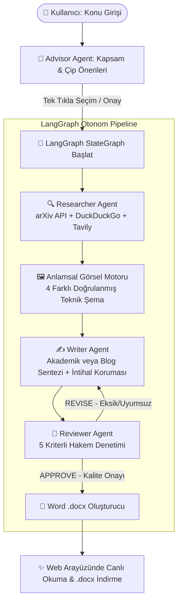

# 🤖 Multi-Agent Workflow: Otonom Akademik Makale ve Teknik Blog Üretim Sistemi

[](https://www.python.org/)
[](https://www.langchain.com/)
[](https://github.com/langchain-ai/langgraph)
[](https://fastapi.tiangolo.com/)
[](LICENSE)

**LangGraph**, **LangChain** ve modern çoklu LLM (Google Gemini, Groq Llama 3.3, OpenAI GPT-4o) mimarisiyle geliştirilmiş; araştırma, doğrulama, görsel entegrasyonu, akademik/blog yazımı ve hakem denetimi aşamalarını otonom yürüten **yeni nesil bir Multi-Agent (Çok Ajanlı) yayın motorudur**.

---

## 📑 İçindekiler

1. [Proje Hakkında ve Temel Vizyon](#-proje-hakkında-ve-temel-vizyon)
2. [Çok Ajanlı (Multi-Agent) Mimari ve Çalışma Prensibi](#-çok-ajanlı-multi-agent-mimari-ve-çalışma-prensibi)
   - [1. Advisor Agent (Kapsam Belirleme ve Etkileşimli Danışman)](#1-advisor-agent-etkileşimli-danışman)
   - [2. Researcher Agent (Akademik & Web Literatür Madencisi)](#2-researcher-agent-araştırmacı)
   - [3. Görsel & Şema Arama Motoru (Anlamsal Filtreleme)](#3-görsel--şema-arama-motoru)
   - [4. Writer Agent (Platform-Aware & İntihal Korumalı Başyazar)](#4-writer-agent-başyazar)
   - [5. Reviewer Agent (Hakem ve Kalite Güvencesi)](#5-reviewer-agent-hakem-denetimi)
   - [6. Word (.docx) Profesyonel Doküman Motoru](#6-word-docx-doküman-motoru)
3. [Kullanılan Teknolojiler ve Kütüphaneler](#-kullanılan-teknolojiler-ve-kütüphaneler)
4. [Sistem ve Bilgisayar Gereksinimleri](#-sistem-ve-bilgisayar-gereksinimleri)
5. [Adım Adım Kurulum ve Çalıştırma Kılavuzu](#-adım-adım-kurulum-ve-çalıştırma-kılavuzu)
6. [Ortam Değişkenleri (.env) Yapılandırması](#-ortam-değişkenleri-env-yapılandırması)
7. [Proje Dizin Yapısı](#-proje-dizin-yapısı)
8. [Önemli Özellikler ve Güvenlik Önlemleri](#-önemli-özellikler-ve-güvenlik-önlemleri)
9. [Katkıda Bulunma ve Lisans](#-katkıda-bulunma-ve-lisans)

---

## 🎯 Proje Hakkında ve Temel Vizyon

Geleneksel tek istemli (single-prompt) yapay zeka yaklaşımları; uzun soluklu araştırma yapma, kaynak doğrulama, teknik görsel seçimi ve akademik kurallara riayet etme konularında yetersiz kalmaktadır. 

Bu proje, bu kısıtları ortadan kaldırmak için **bilişsel işbölümüne dayalı çok ajanlı bir ekosistem** kurar:
* **Sıfır İntihal & %100 Özgün Sentez:** Dış kaynakları motamot kopyalamak veya doğrudan çevirmek yerine kavramları derinlemesine sentezleyen özgün anlatım motoru.
* **Platforma Duyarlı Üretim (Platform-Aware):** Tek tıkla DergiPark/IEEE/arXiv formatında akademik makale (IMRaD, edilgen çatı, bölümsel atıf) veya Medium/Dev.to formatında teknik blog (storytelling, birinci tekil şahıs, metin içi atıfsız, çalışan kod blokları).
* **Anlamsal Görsel Doğrulama:** Konuyla doğrudan alakalı, 4 farklı doğrulanmış teknik şema/diyagram seçimi ve bunların Word belgesine yerleşik olarak gömülmesi.
* **Tıklanabilir Gerçek Kaynakça:** Uydurma referansları engelleyen arXiv API ve akademik havuz doğrulamalı, temiz `https://` bağlantılı kaynakça.

---

## 🏗️ Çok Ajanlı (Multi-Agent) Mimari ve Çalışma Prensibi

Sistem, **LangGraph StateGraph** yapısı üzerinde asenkron durum (state) yönetimiyle çalışır:



### 1. Advisor Agent (Etkileşimli Danışman)
* Kullanıcı bir konu girdiğinde (örn. *"Çok Ajanlı Sistemlerde Pekiştirmeli Öğrenme"*), konuyu analiz ederek ideal çalışma başlıkları, odak alanları, sayfa hacimleri ve görsel sayıları önerir.
* Arayüzde üst üste binmeyen, kullanıcı dostu çip butonları (`chip-btn`) oluşturarak kullanıcının tek tıkla tercih yapmasını sağlar.

### 2. Researcher Agent (Araştırmacı)
* **arXiv API**, **DuckDuckGo**, **Wikipedia** ve **Tavily** entegrasyonuyla literatür taraması yapar.
* Gerçek makalelerin başlık, yazar, yıl, özet ve doğrulanmış arXiv/DOI bağlantılarını derler.
* **İntihal Koruması:** Çekilen makale özetleri yazara aktarılırken *"Yalnızca Arka Plan Referansı - Kopyalamak ve Motamot Çevirmek Yasaktır"* direktifiyle sınırlandırılır.

### 3. Görsel & Şema Arama Motoru
* Wikimedia Commons ve alana özel teknik şema veritabanını tarar.
* **Anlamsal Filtre:** Konu yapay zeka iken biyoloji, hücre, flagellum, atmosfer gibi ilgisiz görsellerin çıkmasını engelleyen negatif kelime filtresi içerir.
* Seçilen 4 görselin metinde tanıtımı ve teknik analizi zorunlu kılınır.

### 4. Writer Agent (Başyazar)
* **Akademik Mod (DergiPark, IEEE, Springer):**
  * IMRaD (Giriş, Yöntem, Bulgular, Tartışma) standardı ve 3. tekil şahıs / edilgen çatı (`"gözlemlenmiştir"`, `"modellenmiştir"`).
  * **Bölümsel Kaynak Dağılımı:** Özet bölümünde 0 kaynak; Giriş ve Literatürde yoğun `[1]`, `[2]` atfı; Bulgular bölümünde 0 dış kaynak (yalnızca yazarın kendi analitik verileri); Tartışma bölümünde karşılaştırmalı atıf.
* **Blog Modu (Medium, Dev.to, LinkedIn):**
  * Sürükleyici 1. tekil şahıs (`"bu mimariyi tasarlarken..."`), ferah paragraflar, TL;DR özeti, ipucu kutuları (`Pro Tip`, `Gotchas`) ve çalışan kod blokları.
  * **Metin İçi Atıf Yasağı:** Okuyucuyu boğan `[1]`, `(Smith, 2024)` gibi işaretler gövdede yer almaz; kaynaklar yazının en sonunda listelenir.

### 5. Reviewer Agent (Hakem Denetimi)
* Üretilen metni 100 puan üzerinden 5 bağımsız eksende değerlendirir:
  1. *Yayın Şablonu ve Dil Uyumu (20 Puan)*
  2. *Özgünlük ve İntihal Denetimi (20 Puan - Motamot çeviri ve kopyalama kontrolü)*
  3. *Kaynak Zenginliği ve Atıf Dağılımı (20 Puan)*
  4. *Görsel Anlamsal Uyumu ve Entegrasyon (20 Puan - Görseller konuyla alakalı mı? Metinde tartışılmış mı?)*
  5. *Tablo ve Bilgi Kutuları (20 Puan)*
* Puan veya biçim yetersizse revizyon talimatlarıyla metni otomatik olarak yazara geri gönderir (`REVISE`).

### 6. Word (.docx) Doküman Motoru
* Başlık, künye, yapılandırılmış özet, tablolar, alıntı kutuları ve dipnotları profesyonel tipografiyle Word belgesine çevirir.
* 4 farklı teknik görseli doğrudan indirerek belgeye gömer.
* Kaynakça bağlantılarını bozuk markdown kaçışlarından arındırıp **doğrudan tıklanabilir saf `https://` hiperlinklerine** dönüştürür.

---

## 💻 Kullanılan Teknolojiler ve Kütüphaneler

| Alan | Teknoloji / Kütüphane | Açıklama |
|---|---|---|
| **Ajan Yönetimi** | `LangGraph` & `LangChain` | Durum makineleri (StateGraph), döngüsel revizyon zinciri ve ajan orkestrasyonu. |
| **LLM Motoru** | `Google Gemini`, `Groq`, `OpenAI` | Gemini 2.5 Flash, Groq Llama 3.3 70B, GPT-4o ile tam esnek LLM fabrikası (`llm_factory.py`). |
| **Backend & API** | `FastAPI`, `Uvicorn`, `Starlette` | Asenkron REST API, Server-Sent Events (SSE) ile tarayıcıya anlık token/durum akışı. |
| **Arama & Veri** | `arXiv API`, `DuckDuckGo`, `Tavily` | Canlı bilimsel makale, DOI ve web verisi toplama araçları. |
| **Doküman Motoru**| `python-docx` | Şablonlu, gömülü görselli ve hiperlinkli profesyonel Word üretimi. |
| **Frontend** | `HTML5`, `CSS3`, `Vanilla JavaScript` | Modern koyu tema, cam efekti (glassmorphism), izole çip paneli, canlı log akışı. |

---

## 🖥️ Sistem ve Bilgisayar Gereksinimleri

Bu sistem, ağır yapay zeka hesaplamalarını yerel ekran kartı yerine bulut tabanlı yüksek hızlı API'ler (Gemini, Groq, OpenAI) üzerinden yürüttüğü için **yüksek donanımlı pahalı bir bilgisayara ihtiyaç duymaz**. Standart bir ev veya ofis bilgisayarında rahatlıkla çalışır.

### Minimum Donanım Gereksinimi
* **İşletim Sistemi:** Windows 10/11 (64-bit), macOS 11+ (Intel veya Apple Silicon), Linux (Ubuntu 20.04+, Debian, Fedora, Arch)
* **İşlemci (CPU):** Çift çekirdekli (Dual-Core) 2.0 GHz veya üstü herhangi bir x86/ARM işlemci
* **Bellek (RAM):** 4 GB RAM
* **Depolama Alanı:** 500 MB boş disk alanı
* **Python Sürümü:** Python **3.10**, **3.11** veya **3.12** (Python 3.10 ve üzeri zorunludur)
* **İnternet:** API çağrıları, literatür taraması ve görsel indirmeleri için aktif ve stabil bir internet bağlantısı

### Tavsiye Edilen Donanım
* **İşlemci:** 4 çekirdekli modern CPU (Intel i5/i7, AMD Ryzen 5, Apple M serisi)
* **Bellek (RAM):** 8 GB RAM veya üzeri
* **Depolama Alanı:** SSD sürücü

---

## 🚀 Adım Adım Kurulum ve Çalıştırma Kılavuzu

### 1. Depoyu Klonlayın
```bash
git clone https://github.com/Ahmet003-cod/Multiagent_ile_makale.git
cd Multiagent_ile_makale
```

### 2. Python Sanal Ortamını (venv) Oluşturun ve Aktifleştirin

* **Windows (PowerShell):**
  ```powershell
  python -m venv venv
  .\venv\Scripts\Activate.ps1
  ```
  *(Not: PowerShell çalıştırma kısıtlaması uyarısı verirse `Set-ExecutionPolicy -Scope Process -ExecutionPolicy Bypass` komutunu çalıştırabilirsiniz).*

* **macOS / Linux (Bash):**
  ```bash
  python3 -m venv venv
  source venv/bin/activate
  ```

### 3. Gerekli Kütüphaneleri Yükleyin
```bash
pip install --upgrade pip
pip install -r requirements.txt
```

### 4. Ortam Değişkenlerini Yapılandırın
Depodaki örnek şablonu kopyalayarak kendi `.env` dosyanızı oluşturun:

* **Windows:**
  ```powershell
  copy .env.example .env
  ```
* **macOS / Linux:**
  ```bash
  cp .env.example .env
  ```

`.env` dosyasını açıp API anahtarınızı girin (Google Gemini veya Groq tamamen ücretsizdir!):
```env
LLM_PROVIDER=gemini
GEMINI_API_KEY=AIzaSy...SizinGeminiAnahtariniz...
```

---

## ⚙️ Ortam Değişkenleri (.env) Yapılandırması

Sistem `LLM_PROVIDER` parametresine göre dilediğiniz yapay zeka modelini otomatik kullanır:

```env
# Sağlayıcı Seçimi: 'gemini', 'groq' veya 'openai'
LLM_PROVIDER=gemini

# 1. GOOGLE GEMINI (Önerilen - Ücretsiz: https://aistudio.google.com/)
GEMINI_API_KEY=your_gemini_api_key_here
GEMINI_MODEL=gemini-2.5-flash

# 2. GROQ CLOUD (Ultra Hızlı Llama 3.3 - Ücretsiz: https://console.groq.com/)
GROQ_API_KEY=your_groq_api_key_here
GROQ_MODEL=llama-3.3-70b-versatile

# 3. OPENAI (GPT-4o: https://platform.openai.com/)
OPENAI_API_KEY=your_openai_api_key_here
OPENAI_MODEL=gpt-4o

# 4. ARAMA MOTORU (İsteğe Bağlı - Girilmezse DuckDuckGo ve arXiv kullanılır)
TAVILY_API_KEY=your_tavily_api_key_here

# 5. SUNUCU AYARLARI
HOST=127.0.0.1
PORT=8000
```

---

## ▶️ Sistemi Çalıştırma

Sistem iki parçadan oluşur: **FastAPI Backend** ve **Web Frontend**. İki ayrı terminal penceresinde başlatınız:

### 1. Terminal — Backend API Sunucusu:
```bash
# Proje ana dizinindeyken
cd backend
python app.py
```
> Sunucu varsayılan olarak `http://localhost:8000` adresinde başlayacaktır. API dökümantasyonunu `http://localhost:8000/docs` adresinden inceleyebilirsiniz.

### 2. Terminal — Frontend Web Arayüzü:
```bash
# Proje ana dizinindeyken
cd frontend
python -m http.server 3000
```
> Tarayıcınızda **`http://localhost:3000`** adresini açarak uygulamayı kullanmaya başlayabilirsiniz!

---

## 📂 Proje Dizin Yapısı

```
multiagent/
├── backend/
│   ├── agents/
│   │   ├── __init__.py
│   │   ├── advisor.py          # Kapsam ve çip öneri danışmanı
│   │   ├── researcher.py       # arXiv ve web literatür tarayıcı
│   │   ├── writer.py           # Platform-aware & intihal korumalı yazar
│   │   ├── reviewer.py         # 5 kriterli hakem denetim motoru
│   │   ├── tools.py            # Arama araçları & görsel filtreleme
│   │   ├── docx_generator.py   # Word (.docx) rapor oluşturucu
│   │   ├── llm_factory.py      # Gemini/Groq/OpenAI sağlayıcı fabrikası
│   │   ├── state.py            # LangGraph StateGraph veri modelleri
│   │   └── graph.py            # LangGraph iş akışı derleyicisi
│   ├── app.py                  # FastAPI REST & SSE backend sunucusu
│   └── requirements.txt        # Backend bağımlılık listesi
├── frontend/
│   ├── index.html              # Modern, izole panelli kullanıcı arayüzü
│   ├── css/
│   │   └── style.css           # Koyu tema, responsive & glassmorphism stilleri
│   └── js/
├── .env.example                # Örnek ortam değişkenleri
├── requirements.txt            # Kök dizin bağımlılık listesi
├── Siber_hz_1.pdf              # 📄 Örnek Çıktı: Siber Güvenlik ve Tehdit Analizi Makalesi
├── mideum_mk.pdf               # 📄 Örnek Çıktı: Medium / TDS Formatında Teknik Blog Yazısı
├── yapay_zeka_makale.pdf       # 📄 Örnek Çıktı: Yapay Zeka ve Çok Ajanlı Sistemler Hakemli Makalesi
├── LICENSE                     # MIT Açık Kaynak Lisansı
└── README.md                   # Proje dökümantasyonu
```

---

## 📚 Depoda Yer Alan Örnek Çıktı Dosyaları (.pdf)

Sistemin ürettiği içerik ve tasarım kalitesini doğrudan görebilmeniz için 3 farklı formatta örnek çıktı repoda yer almaktadır:
* **`Siber_hz_1.pdf`:** Siber güvenlik, tehdit istihbaratı ve savunma mimarilerini inceleyen kapsamlı hakemli makale çıktısı.
* **`mideum_mk.pdf`:** Medium / Towards Data Science formatında, 1. tekil şahıs storytelling, TL;DR, şemalar ve sonda kaynakçalı teknik blog çıktısı.
* **`yapay_zeka_makale.pdf`:** IMRaD yapısında, akademik edilgen çatılı, matematiksel analizli ve 4 teknik diyagram içeren bilimsel dergi makalesi çıktısı.


---

## 🛡️ Önemli Özellikler ve Güvenlik Önlemleri

* **Kesintisiz LLM Fallback Mekanizması:** Gemini veya Groq kota sınırına ulaştığında sistem otomatik olarak yedek modelleri (Flash-Lite veya Llama-3.1) devreye sokar, işlem yarıda kesilmez.
* **Yasaklı Kelime & Görsel Hijyeni:** Wikimedia Commons aramalarında `"flagellum"`, `"atmosphere"`, `"anatomy"` gibi alakasız sonuçlar anahtar kelime eşleştirmesiyle elenir.
* **Doğrulanmış Atıf Ağacı:** Makale içerisindeki tüm iddialar sıralı `[1]`, `[2]` atıflarıyla kaynakçadaki gerçek yayınlara eşleştirilir; sahte link üretimi engellenir.
* **İç İçe Geçmeyen Modern Arayüz:** Öneri çipleri, sohbet penceresi ve işlem butonları bağımsız kutularda (`options-panel`) izole edilmiş olup asla birbirinin üzerine binmez.

---

## 🤝 Katkıda Bulunma

1. Bu depoyu Fork edin (`Fork` butonuna tıklayın).
2. Yeni bir özellik dalı oluşturun (`git checkout -b feature/YeniOzellik`).
3. Değişikliklerinizi commit edin (`git commit -m 'feat: Yeni özellik eklendi'`).
4. Dalınıza push edin (`git push origin feature/YeniOzellik`).
5. Bir **Pull Request (PR)** açın.

---

## 📄 Lisans

Bu proje **MIT Lisansı** altında lisanslanmıştır. Telif Hakkı (c) 2026 **Ahmet Gün**. Detaylar için [LICENSE](LICENSE) dosyasına bakabilirsiniz.
